CUDA Path Tracer
================

**University of Pennsylvania, CIS 565: GPU Programming and Architecture, Project 3**

![A glamorous 3D reimagining of the pufferfish balloon from the illustrated book 'Flotsam' by David Wiesner. Note that due to the large files used to create this render (the hand sculpted splash in front of the camera is 1.35GB), I cannot provide the exact source models (might change in the future if I decide to host the scene somewhere). I do, however, have links to the models I modified for this scene. Everything else was modeled by hand or created using shader nodes in Blender. This image was entirely rendered using my pathtracer, though, of course.](img/FlotsamBalloon.2026-10-03_20-35-33z.50samp.png)

*My 3D reimagining of the pufferfish balloon from the illustrated book 'Flotsam' by David Wiesner.*

* Stephen Gavin Sears
  * [LinkedIn](https://www.linkedin.com/in/gavin-sears-536a1b285), [personal website](https://gavin-sears.github.io/sgavinsears/index.html)
* Tested on: Windows 11, i9-14900HX @ 2.20GHz 32GB, RTX 4090 Laptop 16GB, Compute Capability 8.9 (Personal Computer)

## Table of Contents
- [Features](#features)
  - [Visual](#visual)
    - [Base Pathtracer](#simple-diffuse-materials-emissive-materials-and-stochastic-antialiasing-base-pathtracer)
    - [Stochastic Antialiasing](#stochastic-antialiasing)
    - [Mesh Loading](#mesh-loading)
    - [Refractive Materials](#refractive-materials)
    - [Reflective Materials](#reflective-materials)
    - [Denoising (OIDN)](#denoising-oidn)
    - [Microfacet Materials (GGX)](#microfacet-materials-ggx)
    - [HDRI Environment Lighting](#hdri-environment-lighting)
    - [Physically Based Depth of Field](#physically-based-depth-of-field)
    - [Texture and Bump Mapping](#texture-and-bump-mapping)
    - [sRGB Color Correction](#srgb-color-correction)
    - [Hiding Lights in Refractive Materials](#hiding-lights-in-refractive-materials)
  - [Performance](#performance)
    - [Material Sorting](#material-sorting)
    - [Stream Compaction](#stream-compaction)
    - [BVH](#bvh)
      - [So what is a BVH? (BVH Debug)](#so-what-is-a-bvh)
    - [Visual Feature Costs](#visual-feature-costs)
    - [MIS + NEE](#mis--nee)
  - [UI Customization](#ui-customization)
  - [Fun Bloopers/Outtakes](#fun-bloopersouttakes)
  - [Textures, Models, References](#textures-models-references)

Features
================

## Visual

### Simple Diffuse Materials, Emissive Materials, and Stochastic Antialiasing (Base Pathtracer)

*To recreate this scene, render cornell.json, and set the sphere object material to diffuse_white*

This image fires out one path per pixel every iteration. Every time the path intersects with an object, we multiply the color value for that path, and scatter the ray. We normally have to divide by the pdf of the scattered ray as well, but for an ideal diffuse BRDF with cosine-weighted sampling, the BRDF, cosine term, and pdf cancel out, leaving just the material color. When the ray finally reaches a light, we multiply the path color by the light color and emittance. After all of this is done, we add the path's contributions to a running total for the pixel in the buffer. After all iterations are complete (or before if we want to display the current image), we divide each total by the number of iterations.
There is also stochastic antialiasing in this image, which I will explain next.
### Stochastic Antialiasing

<table border="0">
  <tr>
    <td>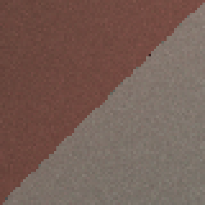</td>
    <td>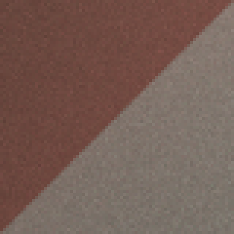</td>
  </tr>
  <tr align="center">
    <td><b>No Antialiasing</b></td>
    <td><b>Stochastic Antialiasing</b></td>
  </tr>
</table>

<table border="0">
  <tr>
    <td>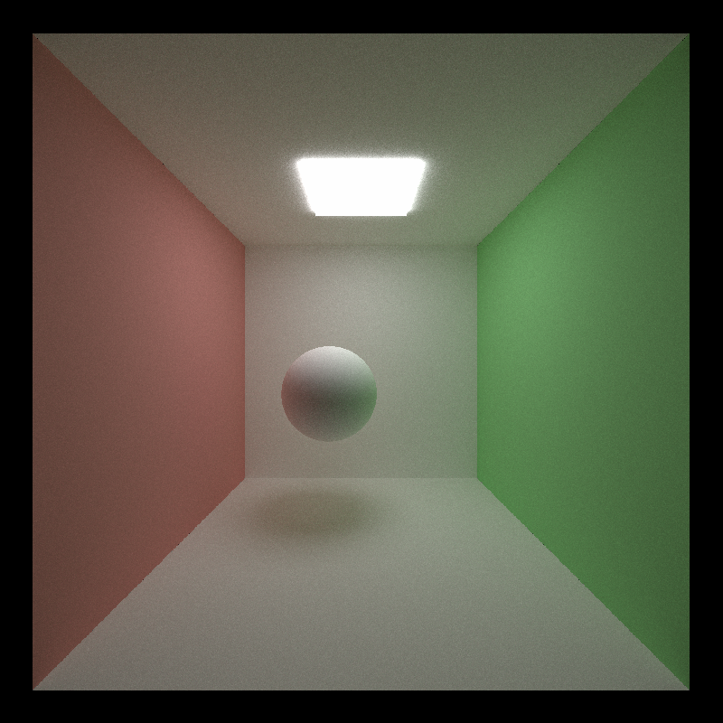</td>
    <td></td>
  </tr>
  <tr align="center">
    <td><b>No Antialiasing (full image)</b></td>
    <td><b>Stochastic Antialiasing (full image)</b></td>
  </tr>
</table>

*Stochastic antialiasing is activated by default for renders in this project. Note that this image has output converted to sRGB.*

When every ray goes through the exact center of its pixel, you can get these imprecise, jagged looking edges. This is known as aliasing: detail finer than a pixel can't be represented, so it shows up disguised as a different pattern. Now, when doing basic rasterization, you might recall a common antialiasing technique known as SSAA (super-sample antialiasing), where we render the image at a higher resolution, then store the average of each group of super samples into the lower resolution image. When we path trace, we can invoke a similar technique that is much less costly. Stochastic antialiasing adds a random (seeded by iteration and pixel location), subpixel offset to the point each ray passes through the image plane. Because we are now sampling multiple locations within the pixel and averaging them afterwards, it gives a very similar effect to sampling from a larger resolution. Above you can see how this effect makes the edge between the left wall and the floor more smooth and realistic looking, and overall how the scene benefits from this effect. The cost of this technique is quite small. For each pixel, each iteration, we generate two random numbers for our offset, as opposed to something like SSAA, where you need to render several samples per pixel (e.g. 4x the pixel count). Since a path tracer already takes a new sample per pixel every iteration, we just move where that sample lands.

### Mesh Loading

*To render this scene, use the scene bunnyCornell.json. You can see how I import meshes in the file (path is relative to scene file)* 

- glTF 2.0 / .glb loading through tinygltf

- records vertex positions, normals, UVs

- All triangles from a given mesh go into one big scene array. The Geometry objects we keep track of only contain a reference to the index of the first triangle, the number of triangles in the mesh, and the bvh root node (I'll get into BVHs later).

- Triangle intersections are done in object space, they use barycentric coordinates to interpolate the vertex normals, and support intersecting with backfaces (this will be used for refraction next).

- Mesh paths in the JSON are relative to the scene file, not the working directory.

### Refractive Materials

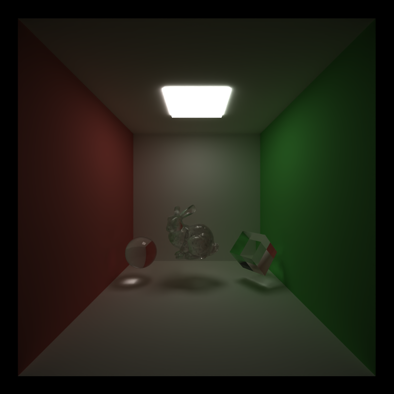

*To render this scene, use the scene bunnyCubeSphereShowcase.json. You may need to set the center three objects' materials to 'glass.' Note that this image uses denoising, which is in the section after the next one*

When a ray hits a refractive material, first we choose whether we want to reflect or refract the ray. We use the Schlick Fresnel term to decide this, which means that if a ray hits the mesh head on (normal and ray are nearly parallel), it will be more likely to refract, and if the ray hits the mesh at a grazing angle (normal and ray are almost perpendicular), the ray will be more likely to reflect. If we get total internal reflection (ray can't exit the material), we reflect instead.

Next, we need to keep track of whether the ray hit a triangle on the inside of the mesh or the outside. This flips the ratio of refractive indices we use in Snell's law (1/IOR when entering, IOR when exiting). For the Fresnel term, we always use the angle on the air side.

After scattering, the new ray origin is pushed along the geometric normal to the side the ray is heading, so refracted rays start inside the object (see blooper at the bottom).

### Reflective Materials

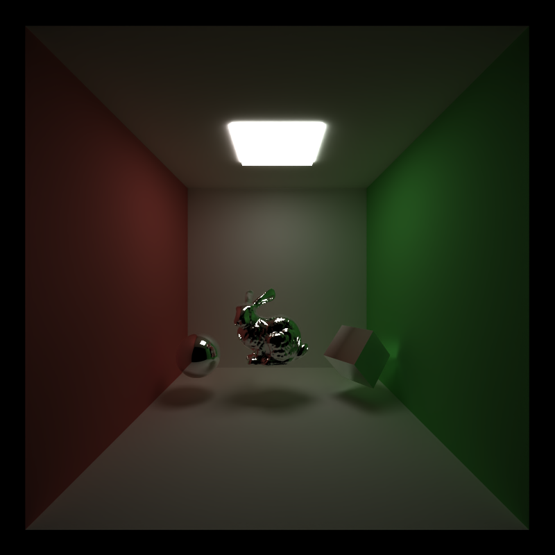

*This image uses the same scene as the previous feature. Switch the materials of the center objects to 'specular_white,' for the same image. You can also have a different color specular material if you set ROUGHNESS to 0.0 and use a different RGB. Note that this image uses denoising, which is in the next section*

This one is pretty straightforward. We just use the function glm::reflect to reflect the ray about the shading normal, and multiply by the material color. If roughness is greater than zero, we switch to GGX.

### Denoising (OIDN)

<table border="0">
  <tr>
    <td>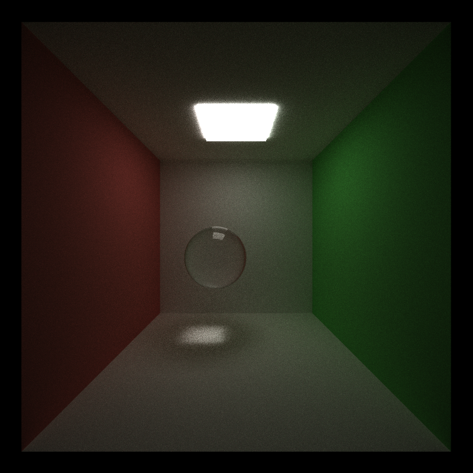</td>
    <td></td>
  </tr>
  <tr align="center">
    <td><b>No Denoising (500 iterations)</b></td>
    <td><b>OIDN denoiser (500 iterations)</b></td>
  </tr>
</table>

*Denoising can be activated using the GUI. This scene is cornell.json with a glass material applied to the sphere.*

Uses Intel Open Image Denoise (OIDN) with its CUDA device so that we can pass our GPU buffers directly to the denoiser. To activate this, you'll need to have OIDN available, otherwise the GUI option will be unavailable.

The OIDN RT filter takes in color (the noisy input), albedo (unshaded colors of render), and normal (normals of render). We can get these without too much trouble by simply recording the colors and normals at the first hit, averaged over iterations. Running the denoising algorithm does not alter the actual path tracing process, but rather runs like a post-processing layer, so it can be toggled on and off without altering the image.

### Microfacet Materials (GGX)

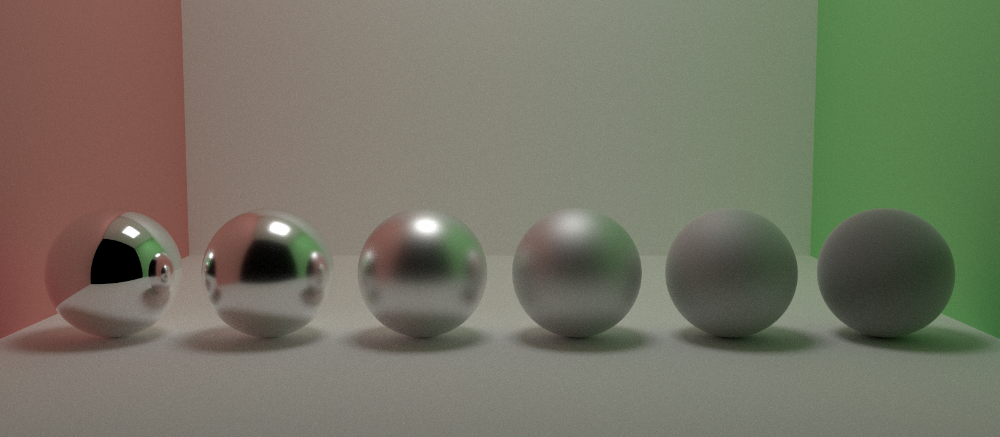

*Roughness 0.0, 0.2, 0.4, 0.6, 0.8, 1.0 (left to right) with the same silver material. The scene is roughnessSweep.json*

A rough metal surface can be thought of as millions of tiny mirrors pointing in slightly random directions. A low roughness means the mirrors are mostly lined up, which then means that the reflections are very clear looking. A high roughness means the directions of the little mirrors have more variance, which then means that the reflection is more blurry. 

When we are creating this effect visually, materials with a roughness of zero simply reflect rays across the normal, and are treated as a delta surface. Anything rougher uses a GGX (Trowbridge-Reitz) microfacet BRDF. A microfacet BRDF uses three terms: for any reflection direction, we calculate how many mirrors point the right way (D), how many are blocked by another mirror (G), and how much light each one reflects (F).

  - The BRDF, Cook-Torrance, is found with the following equation: `F·D·G2 / (4·NdotV·NdotL)`, where V points toward the viewer, L toward the light, and the half vector is `H = normalize(V + L)`.
  - D: the GGX distribution, which says how concentrated the microfacet normals are around H. In this equation, we remap the roughness value to `alpha = roughness²`. This is so changes in the roughness value appear to create equivalent changes in the appearance of the material.
  - G2: height-correlated Smith shadowing/masking, `G2 = 1 / (1 + Λ(V) + Λ(L))`
  (Λ is Smith's masking term, and G1 = 1 / (1 + Λ(V)))
  - F: Schlick Fresnel, with the material color as F0. When you look at the material head-on, you see the color of it more. At grazing angles, the reflections become more white.

Sampling uses Heitz 2018 visible normal (VNDF) sampling. It only generates microfacet normals the viewer can actually see, so most of the terms cancel and the throughput update is just `F · G2/G1`. That gives much less noise than sampling D directly. If a sampled reflection points below the surface, the path is killed.

Because GGX isn't a delta BSDF, it gets NEE + MIS like diffuse surfaces. When we sample a bounce direction, we store its pdf on the path, so MIS can weight it if that ray hits a light on the next bounce.

### HDRI Environment Lighting

<table border="0">
  <tr>
    <td>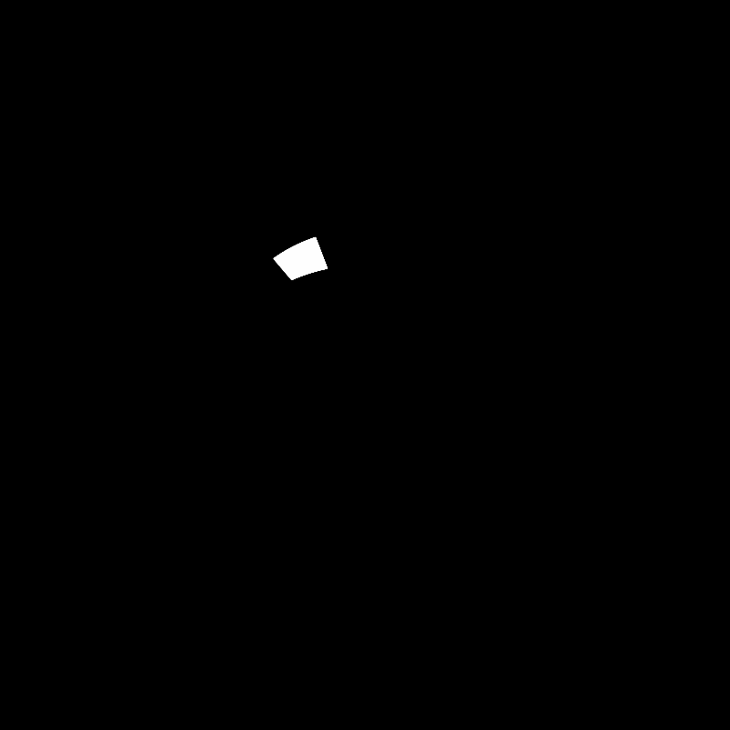</td>
    <td>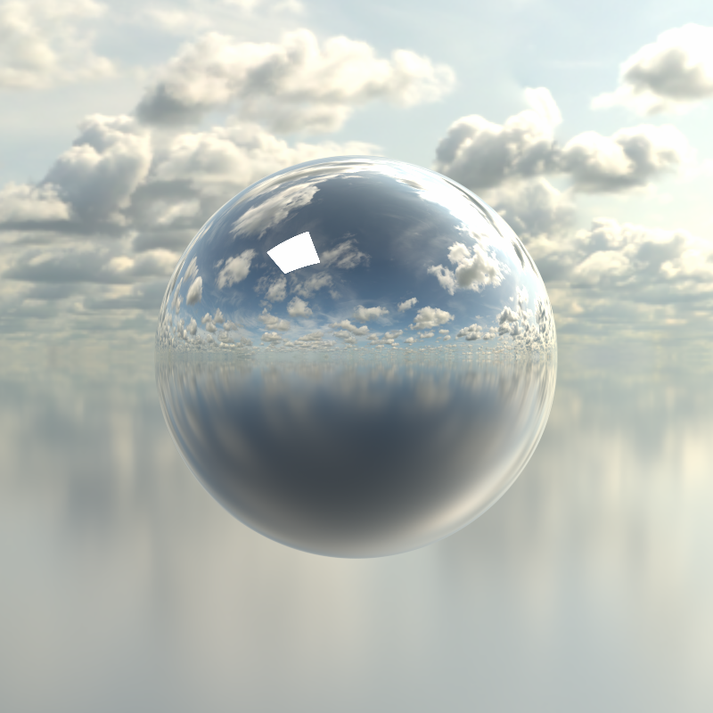</td>
  </tr>
  <tr align="center">
    <td><b>No HDRI (one area light)</b></td>
    <td><b>HDRI</b></td>
  </tr>
</table>

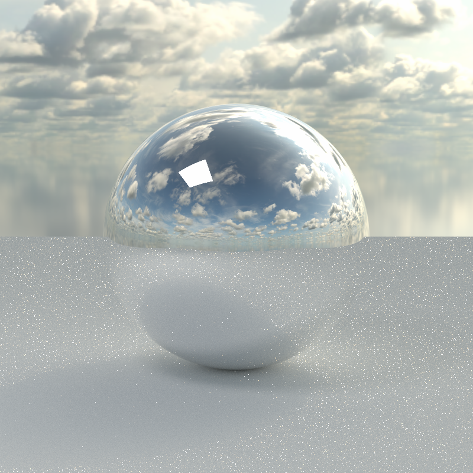

*These scenes are all modified from sphere.json. Change the HDRI parameter on the camera object to add an HDRI. Use paths relative to scene file. Feel free to change HDRI_ROTATION and HDRI_INTENSITY to experiment.*

- tinyexr used with a wrapper to load .exr files

- When paths miss all objects in the scene, they use an equirectangular mapping of the HDRI to determine the color. This means that the actual HDRI texture is a big rectangle that we sample to give the appearance of a sphere surrounding the scene. We use the direction of the bounced ray to sample: `u = atan2(x, -z)`, `v = acos(y)`

You'll notice that the final render has some firefly artifacts (the little glittery specks). When camera rays hit the mirror sphere, they reflect perfectly off, and so the sample we get from the HDRI is coherent (hence why you can see the reflection). However, the diffuse floor surface uses random scatter directions each time a ray hits it. Now, for previous scenes, this creates smooth results, but the HDRI changes things. Some parts of the HDRI are darker, and some parts are extremely bright (especially the sun, which is not super visible in the renders, but you can see it in the HDRI file linked at the bottom of this readme). In other words, the result of lighting this scene with low samples has a high variance. Normally rays are scattering off the floor, getting an average amount of light, and returning. Very rarely, it will hit the sun in the scene, causing a disproportionately bright pixel to appear. This could be solved using MIS + NEE (in performance section) specific to this HDRI. This approach would directly sample the bright sun part and apply a weight to it depending on how likely it was that it was hit. Another approach that could remove the fireflies would be simply to increase the sample number a large amount, since then those bright pixels get weighed down by more likely results.

### Physically Based Depth of Field

<table border="0">
  <tr>
    <td></td>
    <td></td>
    <td>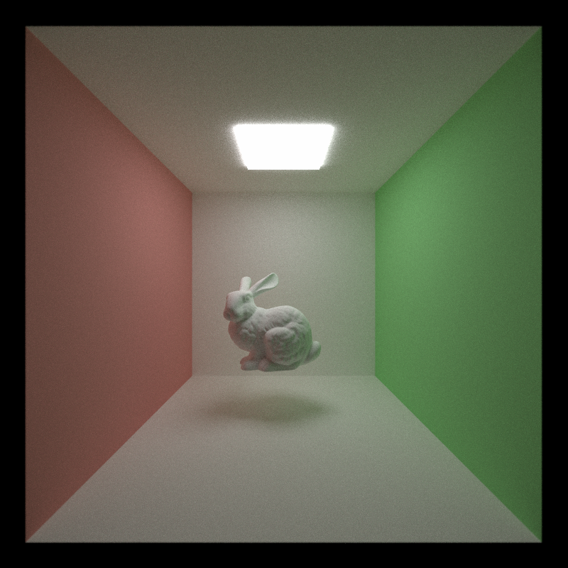</td>
  </tr>
  <tr align="center">
    <td><b>f/1.4</b></td>
    <td><b>f/4</b></td>
    <td><b>f/16</b></td>
  </tr>
</table>

*All focused at 11 units (the bunny)*

<table border="0">
  <tr>
    <td>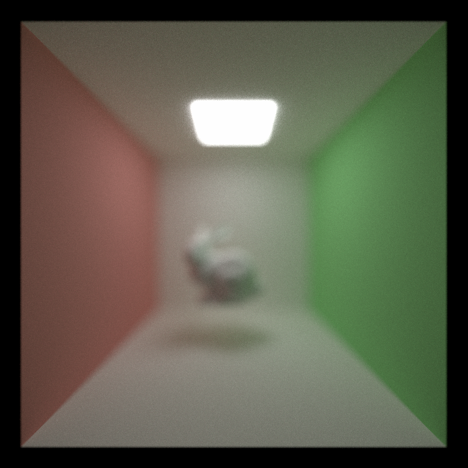</td>
    <td></td>
    <td>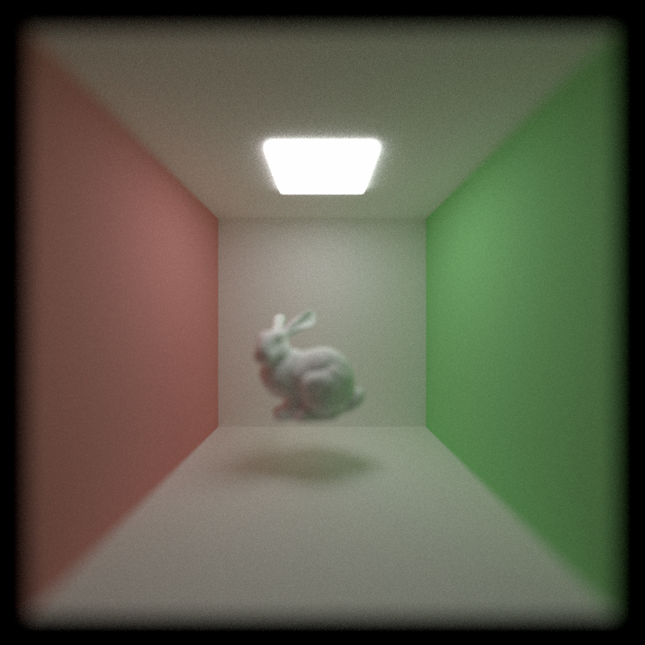</td>
  </tr>
  <tr align="center">
    <td><b>Focus 6 (near)</b></td>
    <td><b>Focus 11 (bunny)</b></td>
    <td><b>Focus 15.5 (back wall)</b></td>
  </tr>
</table>

*All at f/1.4. FSTOP, SENSOR_HEIGHT, METERS_PER_UNIT, and FOCUS_DISTANCE are attributes of the camera object in a json scene that can be edited. GUI controls also exist:*

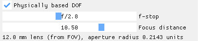

In a basic path tracer, everything in the scene appears to be in focus. In real life, this is very difficult to produce with a real camera, because it implies that the aperture is infinitesimally small (pinhole camera).

However, with real cameras, there is a 'plane of focus,' an imaginary plane that exists some number of units away from the camera (known as the focus distance), and is perpendicular to the view vector. Everything in front of or behind the plane of focus becomes blurry, and everything on the plane is in focus. The reason for this has to do with the physical size and shape of the aperture, lens, and light sensor behind the lens.

When we generate rays from the camera in a basic path tracer, we normally use the same origin for each ray, then aim it through its pixel (with a small random offset for antialiasing).

To convert this approach to a physically based DOF, we first find the plane of focus. The distance from the origin to the plane, tFocus, is found using the equation `tFocus = focalDistance / dot(dir, view)`. The dot product is necessary to force these points onto a plane, since the more similar the view and ray directions are, the smaller it will make the distance. Using this equation, we can use the origin and direction to calculate the actual intersection point between the ray and the plane of focus. We want to make sure that after we simulate a real lens, every ray fired from the pixel we are currently sampling hits this point, so that it is always in focus.

Next, we sample from the lens. We pick a random point in a unit square, then transform it into a unit circle sampling using the Shirley-Chiu concentric disk sampling technique (not worth going into here, but it avoids distorting the random coordinates). With this random unit circle coordinate, we then transform it using our lens radius, which is equal to `lensRadius = focalLength / (2 * FSTOP)`, where the focal length is computed from the sensor size and field of view (`focalLength = (SENSOR_HEIGHT / 2) / tan(FOVY)`, which equals the sensor-to-lens distance when focused at infinity), and the FSTOP has an inverse relationship with the size of the aperture (opening light goes through, so this affects our lens size). From here, we simply set our ray's origin to this sampled point, and calculate the new direction of the ray so that it intersects with the plane of focus point we found (so, `direction = glm::normalize(focusPoint - origin)`). Once we have transformed the ray origin and direction, we pathtrace as normal.

As a result of this process, each ray will have a random offset that corresponds to the lens size. The rays are aimed precisely so that for a given pixel, each ray it fires off will always hit the same spot on the plane of focus. However, if the rays hit something behind or in front of the plane of focus, those rays are not guaranteed to hit the same point anymore. This blurs the image for objects that are too close or too far. Of course, if you have a high fstop, or low focal length (meaning a small lens radius), this blurring effect will not be as pronounced. The scene at the top of this README (Flotsam Balloon scene) uses an fstop of 4.0, a moderate aperture that softens the background slightly without blurring the environment too much.

As a final note, the cost of running this technique is similar to stochastic antialiasing, since we are just generating two random numbers and doing some light vector math once per iteration per pixel.

### Texture and Bump Mapping

<table border="0">
  <tr>
    <td>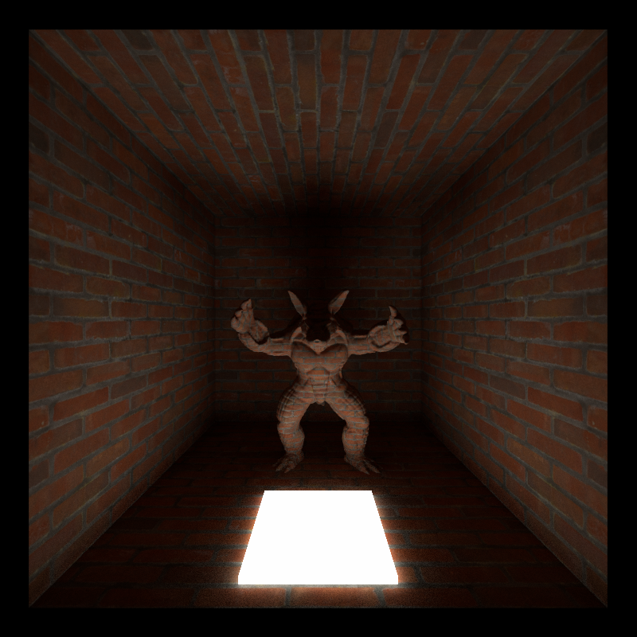</td>
    <td></td>
  </tr>
  <tr align="center">
    <td><b>Color Texture Only</b></td>
    <td><b>Color Texture + Bump Map</b></td>
  </tr>
</table>

<table border="0">
  <tr>
    <td>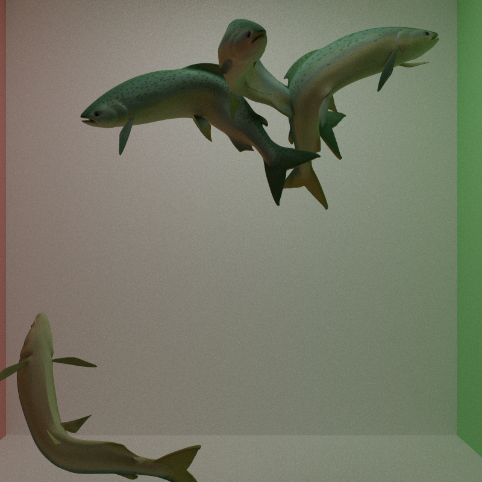</td>
    <td>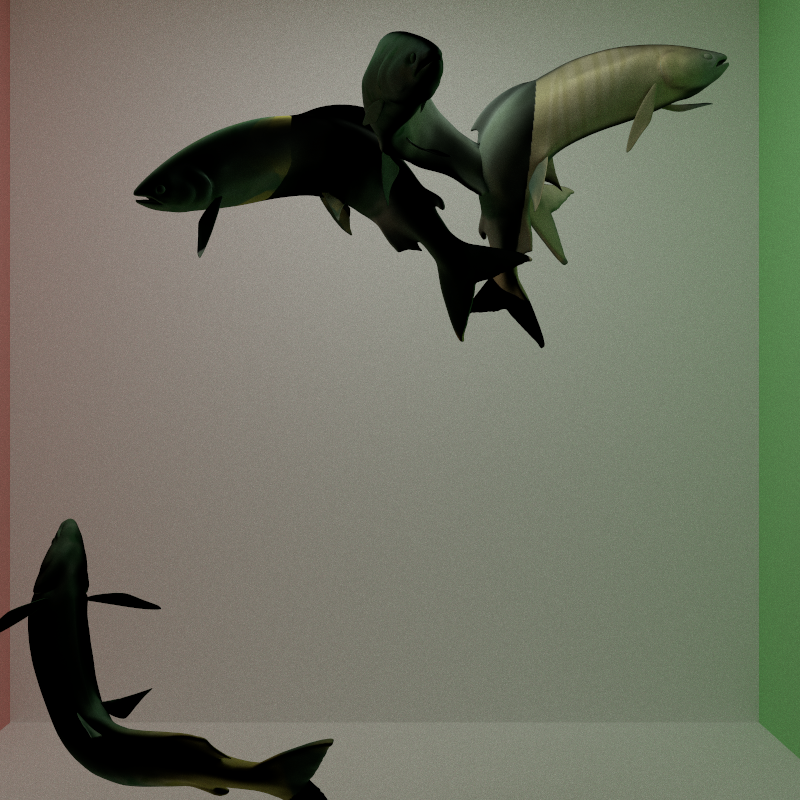</td>
  </tr>
  <tr align="center">
    <td><b>UV Mapping</b></td>
    <td><b>Triplanar Mapping (same texture)</b></td>
  </tr>
</table>

*To recreate the spooky armadillo scenes, render armadilloCornell.json. Set bump strength in the two brick materials to zero to get the bump-less version. The fish scenes use bunnyCornell.json with the bunny swapped for the fish models and the camera zoomed in, but unfortunately, I do not provide the fish models in this repo. You can make a similar version using the fish model in the references section at the end. To use UV mapping, you can simply remove the 'triplanar' MAPPING option if you have a mesh with valid UVs.*

- Supports UV mapping and triplanar mapping. UV mapping uses model UV texture coordinates, and triplanar mapping projects the texture onto the model from x, y, and z directions. Triplanar mapping is only good in instances where you have seamlessly tiling textures and no custom UVs. In the fish scene, you can see how triplanar mapping with a baked UV texture doesn't work, whereas using the actual UVs gives us correct looking textures. However, in instances like the armadillo brick scene, triplanar mapping gives us some pretty good results without needing to mess with UVs or map the textures.

- Texture features include color and bump. Bump textures have a greyscale height value from 0 to 1, which can be scaled by users with the `BUMP_STRENGTH` option in the scene files. After mapping to the mesh, the differences in height are used to calculate new normals (just to be clear, we don't change the actual height at that point, just what the normal would look like due to the height change). In the armadillo scene comparison, you can see how the bump mapping gives the illusion of depth to the bricks in the walls.

- As a final note, bump mapping can sometimes change the normal enough that rays can bounce inside the object randomly. To prevent this, after scattering a ray off a non-refractive object, we check its new direction against the true geometric normal, and if it points into the surface, the path is terminated so it contributes nothing to the scene. Also, if the bumped normal faces away from the viewer, we instead use the geometric normal.

### sRGB Color Correction

<table border="0">
  <tr>
    <td>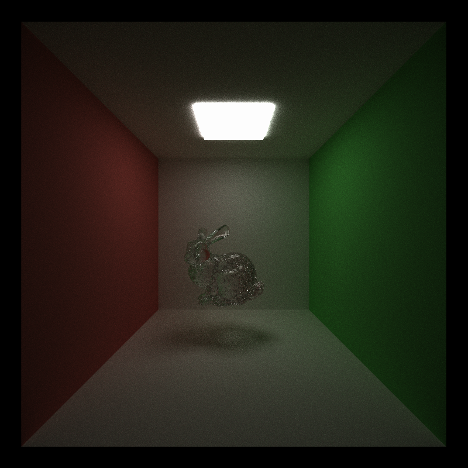</td>
    <td>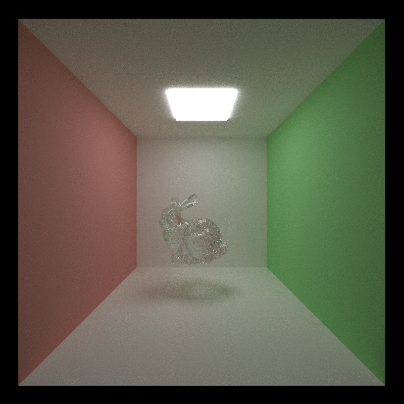</td>
  </tr>
  <tr align="center">
    <td><b>Linear Output</b></td>
    <td><b>sRGB Output</b></td>
  </tr>
  <tr>
    <td>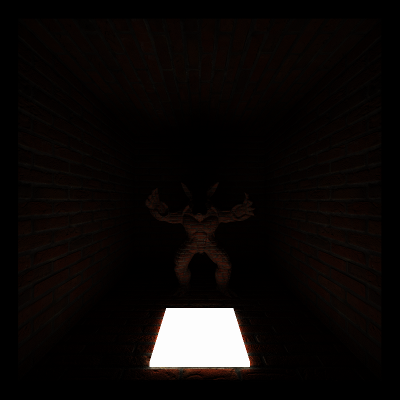</td>
    <td>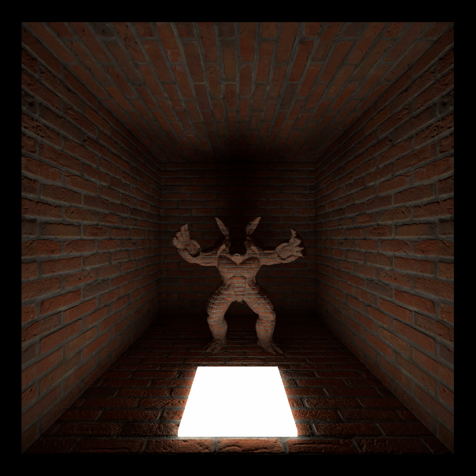</td>
  </tr>
  <tr align="center">
    <td><b>Linear Output</b></td>
    <td><b>sRGB Output</b></td>
  </tr>
</table>

I noticed that some of the best looking path tracer renders used color correction, so I decided that was something I'd like to do as well.

The base path tracer for this assignment works entirely in linear radiance (each color value is proportional to the physical amount of light). However, monitors expect gamma-encoded sRGB values and apply a curve (roughly a power of 2.2) that darkens them, so raw linear values come out too dark. To correct this, we can apply the sRGB encoding curve to the linear image data. As you can see, this brightens images and gives more natural looking colors.

### Hiding Lights in Refractive Materials

<table border="0">
  <tr>
    <td>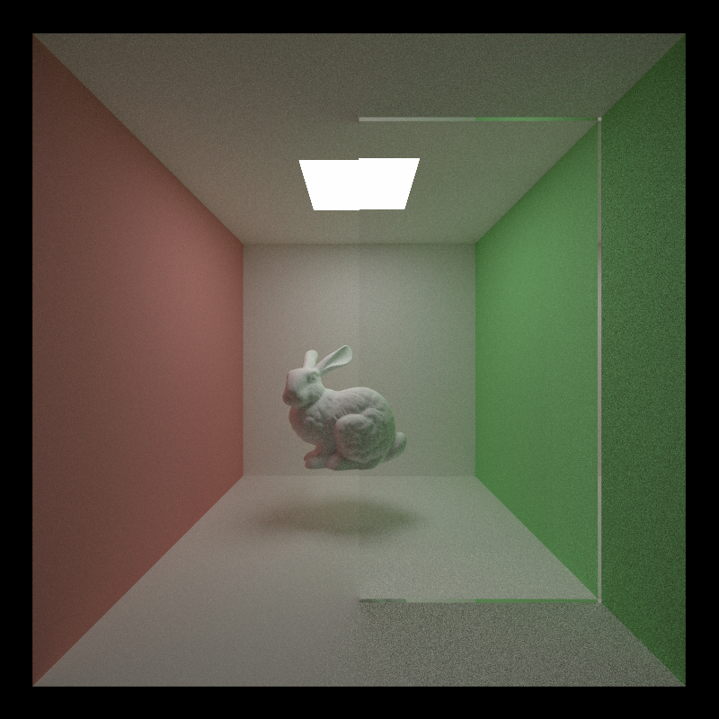</td>
    <td>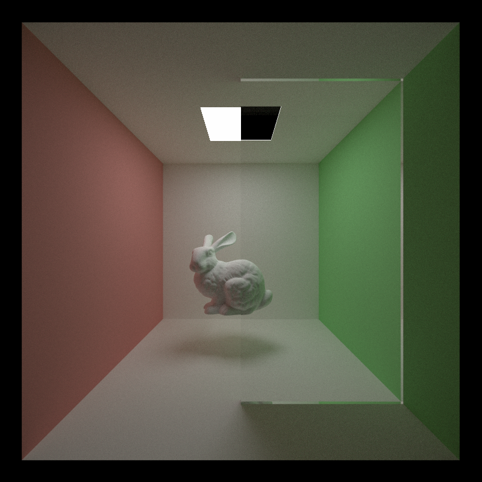</td>
  </tr>
  <tr align="center">
    <td><b>Light Visible in Glass</b></td>
    <td><b>Light Hidden in Glass</b></td>
  </tr>
</table>

*To recreate these scenes, render glassCurtain.json. The light's VISIBLE_IN_GLASS parameter is set to false (hidden); set it to true, or delete the option, to make the light visible in glass again.*

So, the story behind this feature has to do with the pufferfish balloon scene. The reflected light on the splashing water, while pretty, actually is there because there is a massive box light in the sky. The glass material is reflecting/refracting the actual glowing box itself, which I didn't like. To solve this, I made an object-level flag where every time a ray reflects or refracts off a glass object, the next hit will ignore any object whose VISIBLE_IN_GLASS flag is set to false. This is a feature I sometimes use in Blender to hide area lights in scenes when you don't want the reflection to appear. However, in my implementation, it will remove caustics from the scene. You can see how the right picture's right side is darker than the left picture's right side because of this.

This feature ended up being unused in the pufferfish scene. I interviewed some family and friends, and they vastly preferred the highlighted scene, and didn't think it looked unusual. This made me more accepting of this highlight effect, and I simply positioned some objects in the scene and edited geometry to make some of the less pleasant caustics and reflections hidden from view.

## Performance

### Material Sorting

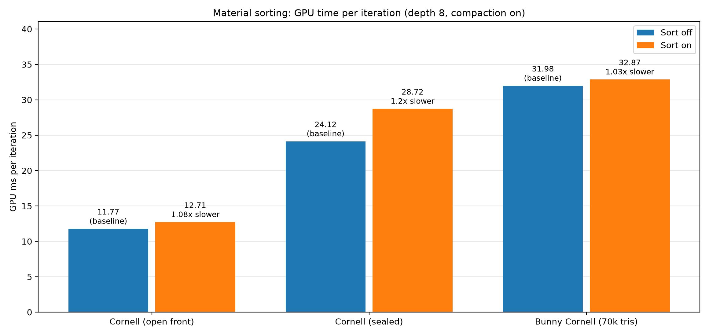

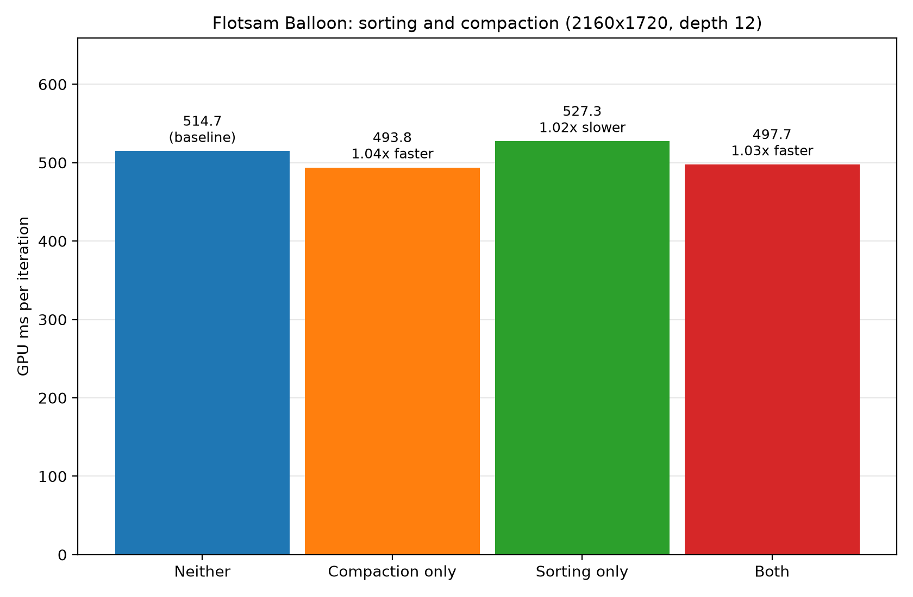

After intersecting with the scene, a function called `buildMaterialSortKeys` records the index of the material that each path intersected with (materialId + 1, or 0 if it hit nothing).

We use the CUB (CUDA UnBound) library's `cub::DeviceRadixSort::SortPairs` to sort an array of path indices alongside the material index array. These sorted indices are then used in a gather function that copies the PathSegment and ShadeableIntersection arrays into new buffers in sorted order, and then we swap the pointers so the sorted buffers become the active ones. We also set SORT_MIN_DEPTH (2) and SORT_MIN_PATHS (16384), which are macros that set the minimum depth for sorting, and the minimum number of paths (since stream compaction removes them over time). In my examples, this means the first bounce is never sorted. Tweaking these minimum numbers is useful, because we don't want to sort our arrays when we don't have many paths left or we just started our iteration, since sorting will be too expensive and/or not provide large enough benefits.

Timing comes from CUDA events around each iteration (printed with `PT_STATS`; the GUI shows a smoothed version as `iterationMs`). The first `PERF_WARMUP_ITERS` iterations are skipped, since those first iterations get slowed down due to the program starting up.

This feature has not created a performance boost for my scenes. There is a big cost associated with sorting every path at every bounce of every iteration, and this is only beneficial if there are large amounts of paths accessing many different materials. The best performance I got was in the Flotsam Balloon (pufferfish) scene, which has 11 materials, and more paths than my other renders (2160x1720, about 3.7 million paths, vs. 640 thousand at 800x800). Even then, it performs slightly worse, which makes me think that the use case is either very specialized for scenes with tons of materials, or my sorting method could be made faster so that it creates an actual performance boost. Lastly, I should note why the overhead varies so much between scenes. The cost of sorting is roughly fixed per path, so how much it hurts depends on how expensive the rest of each bounce is. In the sealed Cornell box (a Cornell box with a wall on the camera side, containing only six cubes), bounces are very cheap, so sorting is a large fraction of the work and adds 19%. In the bunny scene, BVH traversal through 70k triangles makes each bounce more expensive, so sorting only adds 3%. In the Flotsam Balloon scene, which is by far the heaviest scene and has the most materials, sorting adds 2.4% without compaction and only 0.8% with it. Stream compaction also helps in the open scenes by reducing the number of paths that need to be sorted at later bounces. So it's possible that Flotsam's smaller overhead comes mostly from how expensive its bounces are, rather than from sorting actually paying off thanks to its number of materials.

### Stream Compaction

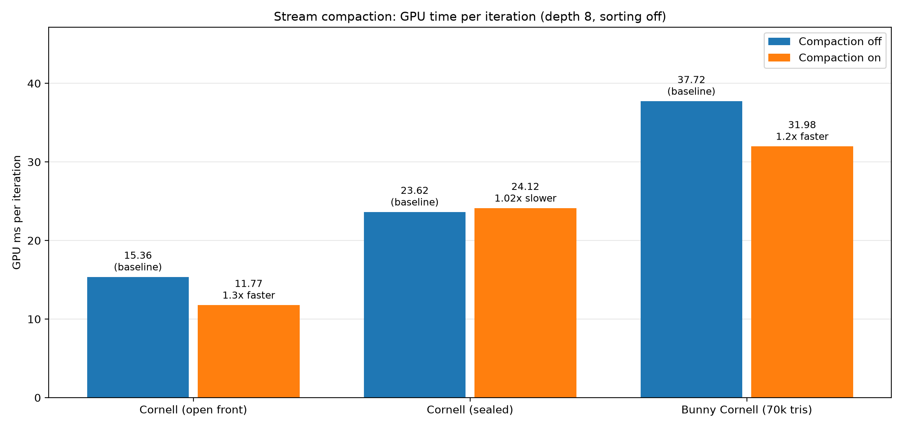

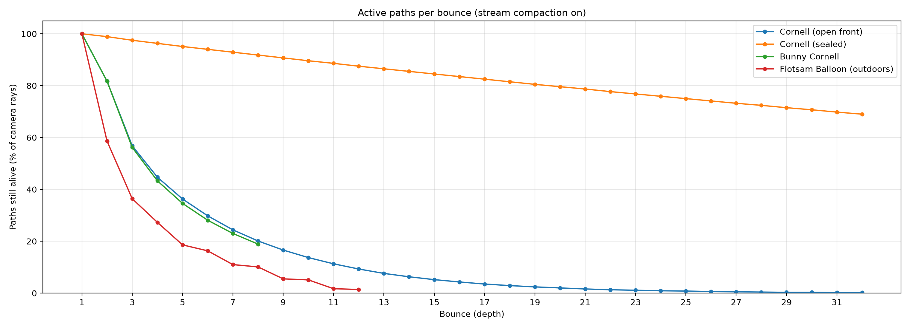

#### Compaction Depth for Open and Closed Scenes

<table border="0">
  <tr>
    <td>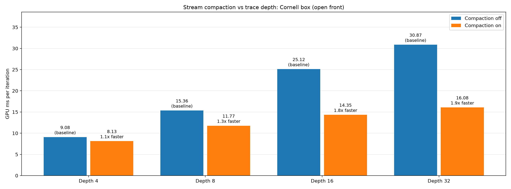</td>
  </tr>
  <tr align="center">
    <td><b>Open Cornell Box</b></td>
  </tr>
  <tr>
    <td>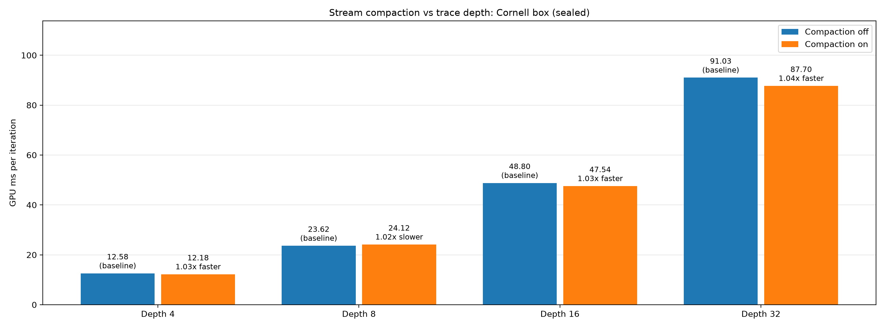</td>
  </tr>
  <tr align="center">
    <td><b>Sealed Cornell Box</b></td>
  </tr>
</table>

Okay, so here is a performance feature that actually has a huge impact (at least in the right scenes).

For every iteration of the path tracer, we launch rays into the scene that bounce around until either:
- they hit a light
- they exit the scene
- a GGX or bump-mapped bounce sends a ray below the surface
- max number of bounces has been reached

Paths that have terminated before the max number of bounces has been reached will continue to have performance impacts, since every bounce still launches a thread for every pixel. Those threads check whether their path has terminated and return early, but they still take up space in warps and add memory reads. The solution to this is stream compaction. After we have finished shading using our paths, we use the thrust library function `thrust::remove_if`, with our condition being that a path object's `remainingBounces` attribute is less than or equal to zero. All of the paths that are still bouncing go to the front of the array, and using the new count of active paths, we can recalculate the grid size of the next bounce's kernels so they only launch threads for the active paths (plus a few spare threads in the last block, which just fail the `idx < num_paths` check). Every finished path already adds its contribution to the image during shading, and rays can bounce until no paths are left instead of always running to the max depth.

As you can imagine, this creates large performance boosts for scenes that have open backgrounds, since many paths will hit said background and terminate early. In sealed scenes, paths can only terminate early by hitting a light or getting bounced into an object due to GGX or bump mapping, so there aren't as many opportunities for stream compaction to reduce. The active paths per bounce chart shows this in action (it shows the percentage of camera rays still alive at the start of each bounce, with compaction on). Some of these scenes have different max bounce values, but you can still see how fast the percentage of live paths approaches zero before the max is reached. The worst case is the sealed Cornell box, where only about 1% of paths die per bounce, so even at the final bounce (32), we are still processing about 70% of the number of paths the first bounce needed to do. In contrast, the open Cornell box and Bunny Cornell scenes have much steeper curves, since both have an open front: about 57% of paths are left by bounce 3, about 20% by bounce 8, and in the open box at depth 32, fewer than 5% of paths are left after bounce 15. On the other end, the Flotsam scene is an open scene that has incredibly expensive bounces that check intersections with millions of triangles. By the third bounce in this scene, we are already processing less than 40% of the original number of paths, and by the last bounce (12), only about 1% are left.

The first chart shows how this translates into GPU time per iteration at depth 8 (with material sorting off). The open Cornell box goes from 15.36 ms to 11.77 ms (about 1.3x faster), and the Bunny Cornell scene goes from 37.72 ms to 31.98 ms (about 1.2x faster). The sealed Cornell box, however, actually gets about 2% slower (23.62 ms to 24.12 ms). Because the number of paths barely lowers for each bounce in the sealed scene, the costs of the `remove_if` function (which reorders the array) start to outweigh any performance benefits we might achieve.

The two trace depth charts show what happens as we increase the max number of bounces. In the open Cornell box, the speedup increases alongside depth, from 1.1x at depth 4 to 1.9x at depth 32. This is because we are terminating lots of paths for every bounce with stream compaction, so additional bounces become less expensive than if we processed every path for every bounce.
In the sealed Cornell box, the iteration time roughly doubles every time the depth doubles, whether compaction is on or off, since there are not as many paths to terminate.

Based on how quickly paths die in the Flotsam scene, I expected compaction to give a big speedup (you can see that we are likely processing less than 50% the number of paths every iteration compared to if we didn't use stream compaction!). However, the compaction only made the render around 1.04x faster. The issue here, as far as I can tell, is that the surviving paths every iteration make up most of the work (probably with refractive materials and other expensive features). The threads we remove weren't doing much in the first place, and the remove_if function has to reorder a large number of paths every iteration, so the performance boost in the end is small.

Overall, stream compaction is most beneficial when lots of paths terminate early. This means open scenes, and especially high trace depths do the best compared to the non-stream-compacted versions. In closed scenes, this feature does not have a big impact. This is because paths rarely terminate, and the actual stream compaction adds some overhead work that more or less cancels out the benefits.

### BVH

<table border="0">
  <tr>
    <td></td>
    <td></td>
  </tr>
  <tr align="center">
    <td><b>No BVH</b></td>
    <td><b>BVH</b></td>
  </tr>
</table>

I ran 50 iterations on a scene with a 69660 triangle stanford bunny, with the results displayed here so you can see that the visual output isn't different. I recorded how long it took to render each of them. 

Without a BVH, it took 29 minutes and 54.503 seconds (1794.503s). With a BVH, that was shaved down to 1.869 seconds for 50 iterations. Doing the math, that is 99.896% less time, or around a 960x speedup, which should show just how essential using a BVH is when rendering meshes.

#### So what is a BVH?

A Bounding volume hierarchy (BVH) improves performance in a pathtracer by making a ray's traversal through a scene more efficient. In a scene with n triangles, the naive way to check for intersections is to go through the n triangles and do intersection tests on each, which is an O(n) process. The BVH I implemented takes all of the triangle geometry, and calculates a bounding box (find corners of a slab that contains the entire mesh). After this, we find the largest axis, and find the median triangle along this axis, then use that to split our triangle data in two. Finally, we recurse the original BVH creation on each subset of triangles. The recursion depth goes until a set maximum limit, or if a node contains under a certain number of triangles (my performance charts and renders use 4 or below, and my BVH debug visuals use 64 or below, because using 4 for those images made it difficult to see). Traversing through this new data structure allows us to ignore roughly half (there can be overlaps in nodes) of the triangles at each step, which results in a O(log(n)) time complexity for checking triangle intersections.

<table border="0">
  <tr>
    <td></td>
    <td></td>
  </tr>
  <tr align="center">
    <td><b>Triangles Colored Per Leaf</b></td>
    <td><b>Outlined Leaf Nodes</b></td>
  </tr>
</table>

<table border="0">
  <tr>
    <td></td>
    <td></td>
  </tr>
  <tr align="center">
    <td><b>BVH Heatmap</b></td>
    <td><b>Outlined Leaf Nodes</b></td>
  </tr>
</table>

Above are two debugging views I implemented for the BVH. The first (top) view shows pixels with random colors that correspond to the leaf node which contains the triangle hit by the ray. The left and right side show this view without and with outlined leaf nodes in the scene respectively. 

The second (bottom) view shows a heatmap that describes how many traversals through the BVH happened at a given pixel in the screen. 
The blue and blue-green sections have minimal traversals, since there isn't any geometry near those places (such as those pale blue green boxes in the upper level, farther away from the mesh). 

Green means there were more BVH nodes to traverse through, but not too many. You'll notice green pixels somewhat closer to the mesh, and in the middle of it. Rays going straight towards the mesh traverse to one leaf node, but boxes beyond that are skipped once a hit is found. The green sections close to the mesh traverse more levels of the tree, but the lack of geometry nearby makes it still relatively inexpensive.

The red pixels very close to the mesh have the most traversals. That is because the ray is intersecting with multiple leaf nodes in the bvh before hitting anything (or not even hitting anything at all, which you can see on the edges of the mesh silhouette). Lastly, you'll also notice that you can see "grid lines" which separate the leaf nodes in the heatmap. This is because pixels at those points are entering more than one node before hitting the mesh, which makes those areas slightly more expensive.

I think the biggest optimization I could add to this BVH implementation would be the addition of SAH splitting to prevent more of the red spots that we see in the heatmap.

### Visual Feature Costs

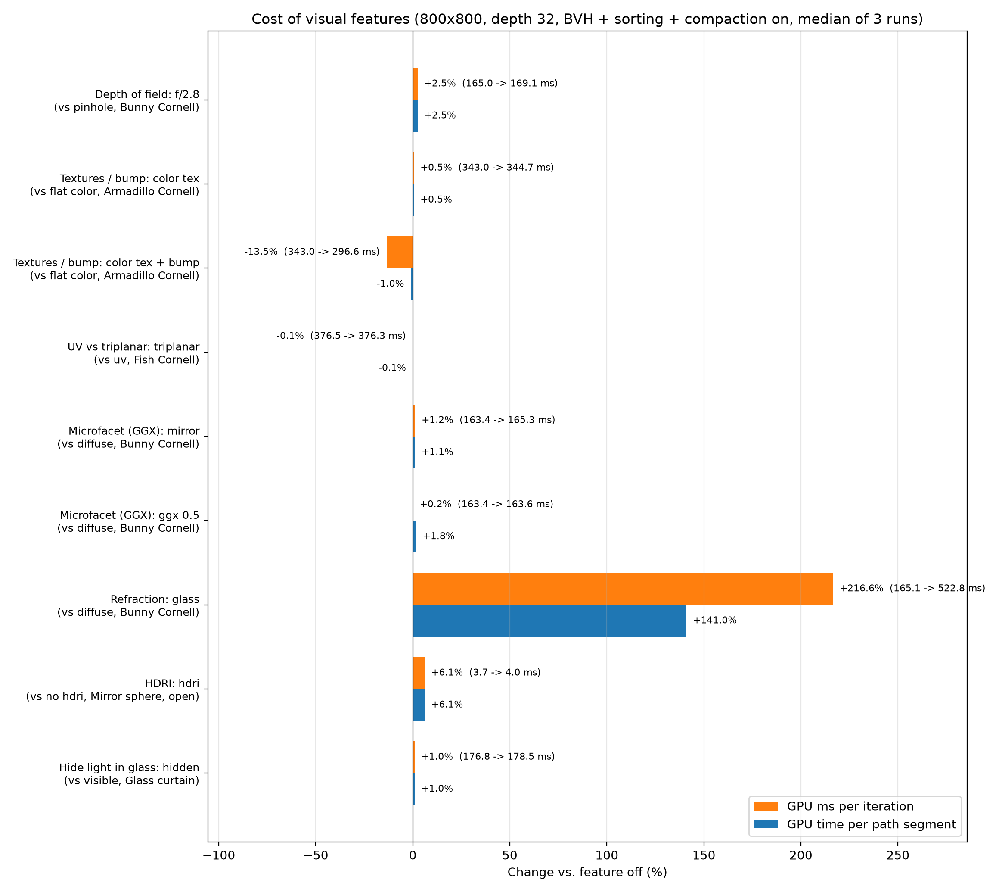

| Feature | Scene | Off | On | Change (per iteration) | Change (per path segment) |
|---|---|---|---|---|---|
| Depth of field | Bunny Cornell | pinhole: 165.0 ms | f/2.8: 169.1 ms | +2.5% | +2.5% |
| Color texture | Armadillo Cornell | flat color: 343.0 ms | color tex: 344.7 ms | +0.5% | +0.5% |
| Color texture + bump | Armadillo Cornell | flat color: 343.0 ms | tex + bump: 296.6 ms | -13.5% | -1.0% |
| UV vs triplanar | Fish Cornell | uv: 376.5 ms | triplanar: 376.3 ms | -0.1% | -0.1% |
| Mirror | Bunny Cornell | diffuse: 163.4 ms | mirror: 165.3 ms | +1.2% | +1.1% |
| GGX (roughness 0.5) | Bunny Cornell | diffuse: 163.4 ms | ggx: 163.6 ms | +0.2% | +1.8% |
| Refraction | Bunny Cornell | diffuse: 165.1 ms | glass: 522.8 ms | +216.6% | +141.0% |
| HDRI | Mirror sphere (open) | no HDRI: 3.7 ms | HDRI: 4.0 ms | +6.1% | +6.1% |
| Hide light in glass | Glass curtain | visible: 176.8 ms | hidden: 178.5 ms | +1.0% | +1.0% |

- All of these runs were done with the `PT_STATS` environment variable set to 1. This prints the mean GPU ms/iteration, measured with CUDA events around the whole iteration, after skipping 5 warmup iterations.

- Each run was 150 iterations at 800x800, depth 32, with BVH, material sorting, and stream compaction on. 

- For each pair of orange and blue bars, we are using the data from three "pairs" of runs (one run with the feature off and one with it on). Each setting ends up with three runs, and we take the median (middle value) of those three. The bars then compare the median with the feature on to the median with it off. However, we don't simply run these pairs in the same order every time. If we did, then a run without a feature would always happen right after a run that uses the feature. If a particular feature was very intense on the GPU, it could create throttling, and affect the next feature that runs. In order to mitigate this issue, each pair of runs is done in alternating order. For example, our first pair of runs has the feature off, then on. The next pair of runs has the feature on, then off, and the final pair has the feature off, then on. This way, the previous run could be on or off for any given run, and on average we should be getting a roughly similar amount of thermal throttling for each of these runs (though one type of pair will get to run in the same order twice, so there will be a small amount of imbalance). If this part doesn't make a lot of sense, I apologize, but I can't think of a better way to explain it. I should also note that for features like mirror surfaces and GGX (as well as flat color, color texture, and color texture + bump), instead of pairs they were actually run in triplets (so GGX on, mirror surface on, and one with a diffuse material for both features being off).

- The chart has two bars per feature. The orange bar is the change in total GPU time per iteration. The blue bar is the change in time per path segment. What this means is we take the total time for the iteration and divide it by the total number of path segments.

- Bump mapping appears to improve the speed, since the bumped normals sometimes scatter rays below the surface of the object. These rays are terminated (about 12.6% fewer path segments), and the per-segment cost barely changes (-1.0%). An interesting thing to note is that this can also make scenes a little darker. 

- Textures don't affect performance much at all in general, since for each ray bounce on a textured object, we are just adding one color and four bump texture lookups for UV mapping, or three color and twelve bump lookups for triplanar. Fifteen lookups for triplanar with bump and color mapping maybe sounds like it could be a lot, but it's not really.

- HDRI appears to have a somewhat large impact, but this is being affected by the decision to analyze each feature's performance on a different scene. The scene we are testing this feature on is a big open scene where most rays escape almost immediately, so each iteration only takes about 4 ms, and the +6.1% is only about 0.2 ms. In reality, we are doing one texture lookup for every ray that escapes the scene, so the performance impact of this feature is not that bad.

- DOF, GGX, perfect specular surfaces, and hiding lights in glass all don't have large performance impacts. These features do slightly more math per ray per bounce (except for DOF, which is even less, since it only generates some random numbers when the rays are generated), which is nothing expensive. In the case of GGX, we actually have a similar situation to bump mapping: a sampled reflection sometimes points below the surface, and that path is killed. So the per-iteration cost (+0.2%) is lower than the per-segment cost (+1.8%).

- Glass has a large performance impact. Rays that would have bounced off a diffuse surface and exited the scene now pass through the glass and keep bouncing. Total internal reflection can also trap them inside the bunny until they hit the depth limit (there is no Russian roulette). The result is about 31% more path segments, and each segment costs about 2.4 times as much. To make this even worse, BVH likely doesn't help much, since rays inside the object will start inside multiple overlapping nodes. Maybe the SAH I mentioned earlier could help with this, or visiting the nearer BVH child first so traversal can stop earlier.

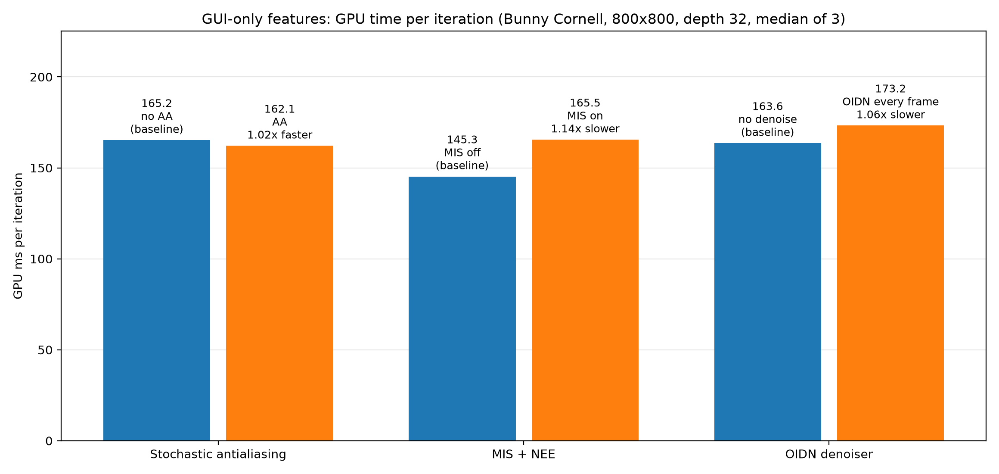

*I have these features in a separate section because right now they are only in the GUI. They have no scene key or environment variable, so I measured them with temporary builds that flipped each default, using the same scene, settings, and 3-run alternating median. The features in question are stochastic antialiasing, MIS + NEE, sRGB conversion, and denoising.*

To start, note that I don't include sRGB. This is because the cost is negligible. It adds a `pow` per pixel in the display kernel, which already runs every frame, so it's not going to impact performance.

Antialiasing also has a negligible cost. In this example it is faster, but that's really just due to chance: the individual runs ranged from about 161 to 167 ms for both settings. Every iteration we are calculating two random numbers for every pixel, which is not going to affect performance.

Now, MIS + NEE does have a noticeable effect. We have a ~14% performance hit. This seems bad at first, except that the image quality is going to be considerably better, so that runtime cost is actually worth it (in the next section I kind of repeat this).

Finally, OIDN also shows a performance hit. This is kind of a combination of the sRGB dilemma and the MIS + NEE performance hit. Right now it runs on every iteration (about +10 ms, or 6%) because every iteration is displayed. We really only need to run it when we display an image, so for a final render we would only run it once, which becomes a negligible performance impact. Additionally, denoising an image can give us results similar to a higher sample image when we have reached a certain point, so it could be argued that we won't need to do as many iterations as before, similar to MIS + NEE. Overall, the performance impact of denoising is low, or perhaps even beneficial depending on how we use it.

### MIS + NEE

<table border="0">
  <tr>
    <td>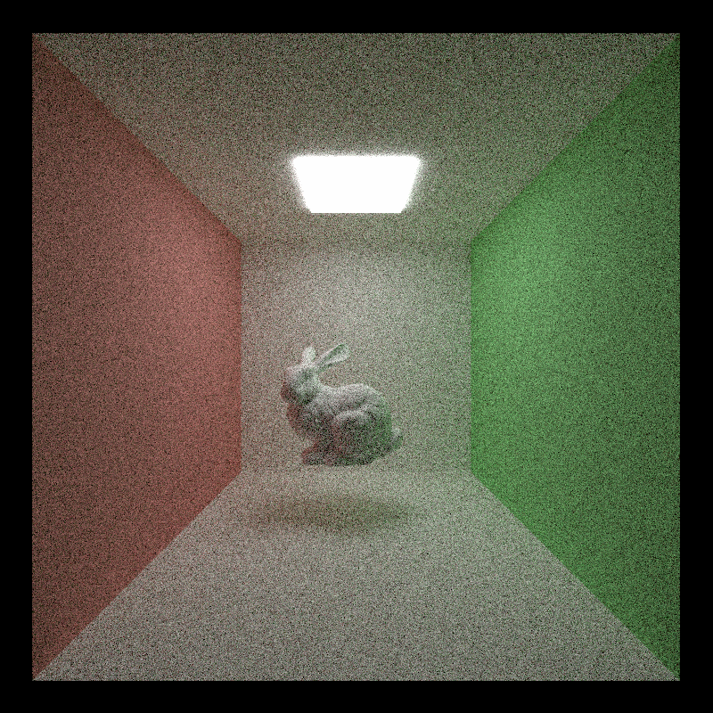</td>
    <td></td>
  </tr>
  <tr align="center">
    <td><b>MIS + NEE off (100 iterations, 145 ms/iter)</b></td>
    <td><b>MIS + NEE on (100 iterations, 166 ms/iter)</b></td>
  </tr>
</table>

*To recreate this scene, render bunnyCornell with and without the MIS + NEE (direct lighting) option in the GUI. The GUI timer gives a rough cost, but the numbers here came from a build with MIS + NEE off by default, since the toggle is GUI-only.*

As you can see, MIS + NEE costs roughly 13.9% more per iteration. This cost comes from the extra shadow ray doing a scene traversal at each non-delta bounce, plus an extra BSDF evaluation. The number of path segments is the same either way.

However, this cost is worth it, as the quality of the scene improves by a considerable amount. Matching the noise level of the MIS + NEE image without this feature active would take far more than 14% more iterations, so we are actually saving time and processing power for similar images.

- NEE: At every non-delta hit (diffuse or GGX), we pick a random light in the scene, and then sample a random point on it. We then launch a shadow ray from our hit point to the random light point. If the point is unblocked, we add `throughput · f · cos · Le / pL` (times the MIS weight below) directly to the pixel, where `Le` is the light's emission. The light's area pdf is `1 / (area · numLights)`, which is converted to a solid-angle pdf by multiplying it by `dist² / cosLight`. This makes it comparable to the BSDF pdf.

- MIS: This technique builds off of NEE. The light we sample with NEE can also be found naturally by the ray bouncing around the scene. Each of these two ways is weighted with the ($\beta$ = 2) power heuristic, so the light isn't counted twice:
  - The NEE sample gets `pL² / (pL² + pB²)`.
  - A BSDF-sampled ray that hits a light gets `pB² / (pL² + pB²)`, using the BSDF pdf stored on the path at the previous bounce.
  - `pL` is the solid-angle pdf of the light sampler picking that direction: `(1 / (area · numLights)) · dist² / cosLight`.
  - `pB` is the solid-angle pdf of the BSDF sampler picking that same direction: `cosθ / π` for diffuse, and `D · G1(wo) / (4 · cosθo)` (the visible-normal pdf) for GGX.
  - Note that these two weights always add up to 1.

- This power heuristic actually helps GGX considerably. Normally, we activate NEE for diffuse surfaces and deactivate it for delta surfaces (mirror, glass). But when we have a GGX surface that lies somewhere in between, we can weight the samples and get something that works better than the BSDF or the light sample alone.

- One main limitation of my implementation is that it only supports cube (box) lights. In particular, the HDRI is never light-sampled, so expanding this feature to HDRIs could improve some of my scenes.

### UI customization

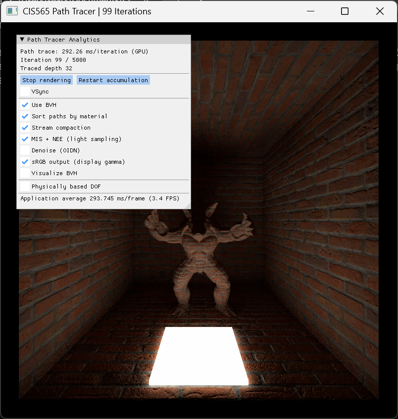

Some quality of life testing tools, like stopping and starting the render, toggling vsync (so I can make sure it's off), using BVH, sorting paths by material, stream compaction, MIS + NEE, Denoising, sRGB output, BVH debug visuals, and Physically based DOF. I also have GPU timers that give the CUDA iteration runtime alongside the application frame runtime.

### Fun Bloopers/Outtakes

This scene appears to be normal, except that the shadow of the bunny has strange holes in it. For a while I was thinking this could be an issue with my BVH, but my non-bvh version also had this issue.
I threw the bunny into Blender to decimate it or subdivide it to see if the geometry density was the issue, and... there were holes in the bottom of the mesh which made it non-manifold. It turns out that rays were shooting out of the camera, hitting the ground, bouncing up, going through the bunny, and then going through the backfaces (I was using glm::intersectRayTriangle at the time, which backface culls). From there the rays were finding the light, and so the floor got illuminated in those spots. I filled the holes in Blender, and that solved it.

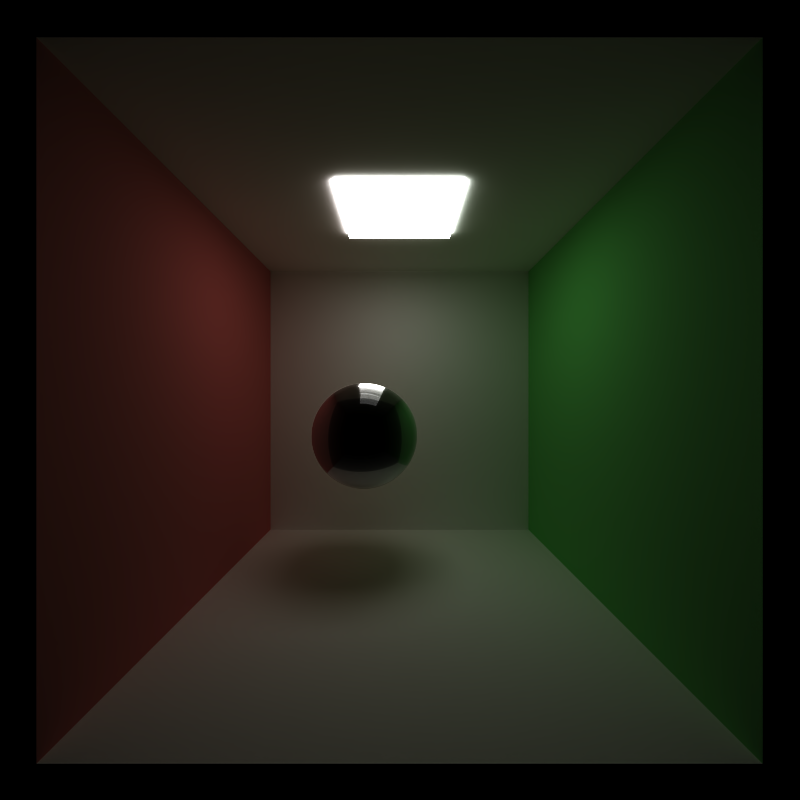

Looks like a regular specular surface, right? What if I told you this was supposed to be a refractive object... In my scatterRay function (where we calculate the new direction for a ray bouncing around the scene), the hit point passed into the function was pulled back by a small epsilon so that the ray didn't hit the object more than once. I originally offset the ray along the normal by a small epsilon within the function as well, with a sign that depended on whether the ray reflected or refracted. Because of this, the offsets would cancel each other out with refracted rays, and the rays were repeatedly bouncing on the surface of the object. In order to fix this, the exact point was passed into scatterRay instead of the pulled back one. The epsilon value was also changed to be higher.

### Textures, Models, References:
- "Sunflowers (pure sky)" HDRI by [Sergej Majboroda](https://polyhaven.com/a/sunflowers_puresky)
- Brick texture by [Rob Tuytel](https://polyhaven.com/a/red_brick)
- Pufferfish scan by [ffish.asia / floraZia.com](https://sketchfab.com/3d-models/cc0-inflated-balloonfish-6e73c83cf10f4c6f8189dff3b4936ff6) (modified)
- Fish model by [Nyilonelycompany](https://sketchfab.com/3d-models/marine-life-fish-non-commercial-a17940f44f624702a1462ccacb597d2b) (texture modified)
- Basket model by [Tribe3d](https://www.turbosquid.com/3d-models/basket-max-270038?dd_referrer=) (modified)
- Hot air balloon bags taken from model by [Anton Krupnov](https://sketchfab.com/3d-models/hot-air-balloon-0794a171bc7d45949a8bd5f13ab3dd71)
- Bunny and Armadillo from [Stanford 3D Scanning Repository](https://graphics.stanford.edu/data/3Dscanrep/)
- Hot air balloon scene based off of a similar scene depicted in David Wiesner's illustrated book [Flotsam](https://www.harpercollins.com/products/flotsam-david-wiesner?variant=39936815726626)